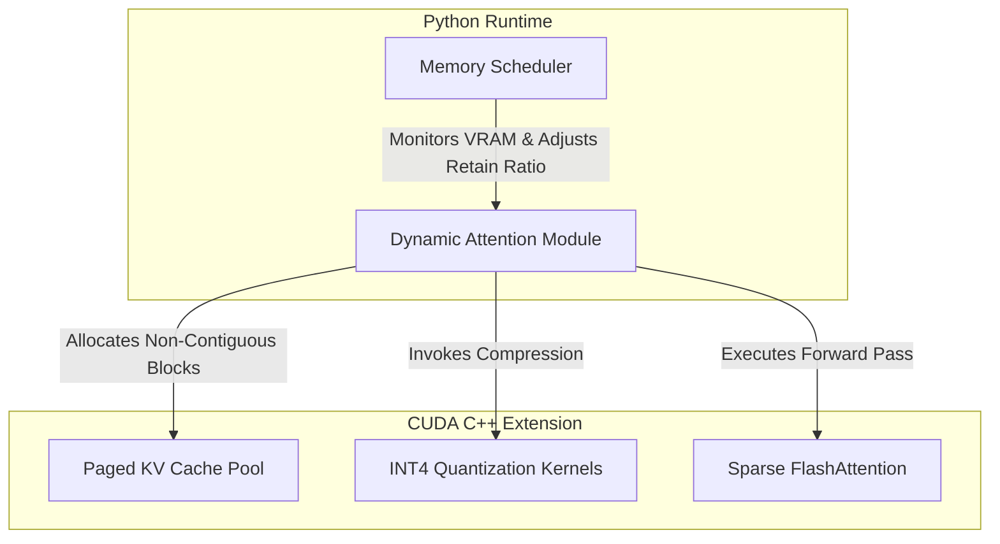

# MemOpt: Dynamic Memory Optimization for Transformer Inference


## Abstract & Overview

**MemOpt** is a research-grade runtime system designed to drastically reduce the VRAM footprint of modern Transformer models during inference. By dynamically managing the Key-Value (KV) Cache and Activation Memory using state-of-the-art constraint methodologies, MemOpt facilitates exponentially longer context lengths under strict multi-tenant GPU memory budgets without severe degradation in perplexity.

## Theoretical Foundations

This project implements and extends novel, heavily-researched optimizations drawn from 2024 MLSys and AI architecture literature:

1. **Token Pruning (Ada-KV / PyramidKV):** Attention-score-based pyramidal funneling. Tokens that exert minimal influence on the attention matrix are dynamically evicted from the KV layout, mitigating the linear memory scaling of autoregressive generation.
2. **W4A16 KV Cache Quantization:** INT4 compression of the KV cache utilizing group-wise symmetric quantization to reduce the VRAM footprint by up to 75% while maintaining model acuity.
3. **Sparsity-Aware / Chunked Activations (AutoChunk):** Slicing forward-pass activations in extremely long sequences to prevent Out-Of-Memory (OOM) errors, distributing activation memory across the temporal domain.
4. **Runtime Memory Scheduler:** A heuristic-driven control loop profiling `torch.cuda.memory_allocated()` that adaptively scales quantization aggressiveness and eviction rates when hardware bounds are pressured.

## System Architecture

The MemOpt architecture is bifurcated into a high-level Python API (`memopt.nn`), operating as the heuristic control plane, and a low-level C++/CUDA acceleration backend acting as the data plane.



## Project Structure

```text
memopt-transformer-runtime/
├── src/
│   ├── memopt/               # High-level PyTorch APIs
│   │   ├── __init__.py       # Auto-loads C++ bindings
│   │   ├── scheduler.py      # Dynamic memory scheduling policies
│   │   └── models.py         # Baseline Transformer wrappers
│   └── csrc/                 # Low-level CUDA/C++ kernels
│       ├── extension.cpp     # Pybind11 registration
│       ├── kv_cache.cu       # Paged memory management
│       ├── attention.cu      # Custom FlashAttention w/ token dropping
│       └── quantization.cu   # INT4 fused de/quantization
├── tests/                    # Unit testing suite (torch.allclose validations)
└── setup.py                  # Torch CUDAExtension build configuration
```

## Installation and Quick Start

### 1. Build the CUDA Backend
Ensure the NVIDIA CUDA toolkit is present in your environment, then compile the native extensions:
```bash
pip install -e .
```

### 2. Empirical Validation
Track exact peak VRAM differentials and tokens/second throughput:
```bash
python scripts/bench_memory.py --model llama-7b --seq-len 8192
python scripts/bench_latency.py
```

### 3. Unit Testing
Guarantee mathematical equivalence back to the standard `torch.nn.MultiheadAttention`:
```bash
pytest tests/
```

## Future Work & Research Directions

While the current implementation targets baseline thresholding for KV cache eviction and static group-wise quantization, multiple avenues for future research exist:
- **Reinforcement Learning-Based Scheduler:** Replacing the heuristic rule-based `MemoryScheduler` with an RL agent trained to preemptively optimize the context window distribution.
- **Speculative Decoding Integration:** Analyzing the memory overhead introduced by draft models in speculative execution and mitigating it via dynamic memory pooling.
- **Cross-Layer KV Offloading:** Expanding the memory hierarchy to encompass asynchronous NVMe/CPU offloading for historically cold KV cache blocks.

## Citation

If you utilize MemOpt in your research, please cite this repository:

```bibtex
@software{memopt_2026,
  author = {Luis Ddaniel Ferreto Chavarria},
  title = {MemOpt: Dynamic Memory Optimization for Transformer Inference},
  year = {2026},
  url = {https://github.com/yourusername/memopt-transformer-runtime}
}
```
